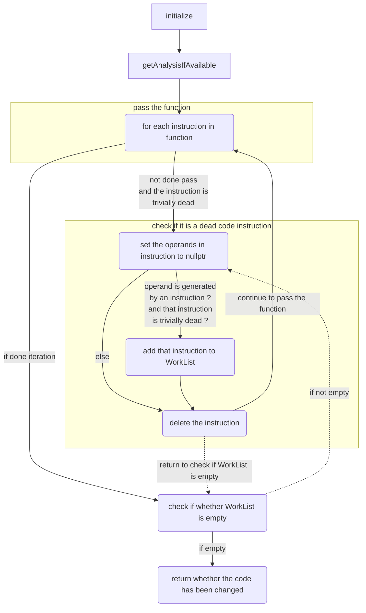
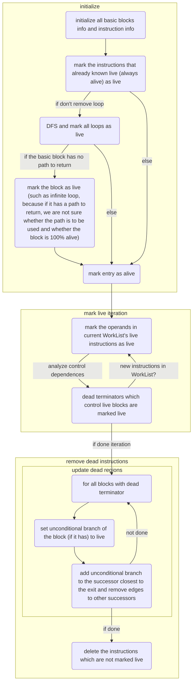

# lab3-2实验报告

虞佳焕（队长）：PB17121687

张博文：PB17000215

彭定澜：PB17111607

## 实验要求

阅读 llvm 中的部分代码优化过程实现，理解 llvm Pass 的作用以及一些的常用代码优化算法的实现。

## 报告内容 

### DCE

#### Pass 的类型和作用

DCE 属于 Function Pass，能够比较保守地删除函数中的死代码。

可以删除的死代码类型为：如果某个量被声明但后续没有被使用，且初始化赋值该量时没有其他的潜在作用，则删除这个量的声明指令。

#### DCE 对设计的 LLVM IR 的优化

对于以下待优化代码：

```llvm
define i32 @some_func(){
  ret i32 1
}

define i32 @test_dce(){
  %used_alloca.ptr = alloca i32
  %unused_alloca.ptr = alloca i32               ; (1) DCE 中会被删除
  %unused_tmp = load i32, i32* %used_alloca.ptr ; (2) DCE 中会被删除
  %tmp_wont_delete = call i32 @some_func()      ; (3) 调用函数可能会造成额外作用，因此这句不能删除
  store i32 0, i32* %used_alloca.ptr
  %ret_val = load i32, i32* %used_alloca.ptr
  ret i32 %ret_val
}
```

执行 `opt -dce -S dce.ll`, 输出的代码如下：

```llvm
define i32 @some_func() {
  ret i32 1
}

define i32 @test_dce() {
  %used_alloca.ptr = alloca i32
  %tmp_wont_delete = call i32 @some_func()
  store i32 0, i32* %used_alloca.ptr
  %ret_val = load i32, i32* %used_alloca.ptr
  ret i32 %ret_val
}
```

可以看出原始代码中的 `(1)` `(2)` 两句，由于声明的 `unused_alloca.ptr` 和 `unused_tmp` 都未再被使用，因而被 DCE 过程删除。

而 `(3)` 中由于初始化 `tmp_wont_delete` 使用了一个函数调用的返回值，有潜在的额外影响，因此不能删除。

#### DCE 的流程

1. 初始化；
2. 对于函数中的每个 `trivially dead` 的指令 `a`：
   1. 对于这条指令中的每个操作数 `x`, 找到产生这个操作数的指令 `b`；
   2. 在 `a` 中把 `x` 置空；
   3. 如果此时 `b` 是 `trivially dead` 的，则把 `b` 加入 `worklist` 中；
   4. 删除指令 `a`;
3. 检查 `worklist` 是否为空，如果不为空，对于其中的每个指令，执行 `2.1` ~ `2.4`, 然后跳转到 `3`;
4. 结束。



### ADCE

#### Pass 的类型和作用

ADCE 属于 Function Pass，激进地删除函数中的死代码。

删除的死代码的类型有：

- DCE 中的所有被删除的类型；
- 如果对于某个条件分支，无论执行流程通过哪个分支，得到的执行结果都一样，则把此条件分支改为**跳转到其两个后继 basic block 中 “距函数返回点更近” 的后继 basic block** 的无条件分支。此优化能用执行代价更小的无条件跳转替换有条件跳转。
  
  **“更近”** 被定义为：以**流图**中没有后继的 basic block 为根节点（一般含有 `ret` 语句），在**反向流图**（逆转所有边）中进行**后序 DFS** 所给出的 basic block 访问顺序（用一个数字描述），**数字越大，代表距离返回点 “更近”**。

####  ADCE 对设计的 LLVM IR 的优化

**ADCE 包括 DCE 的全部优化，此处不再赘述，仅指出 ADCE 相对 DCE 增加的优化部分。**

对于以下待优化代码：

```llvm
; 这个函数不会被优化
define i32 @test_adce_origin(i32 %a){
  %result.ptr = alloca i32
  %cmp = icmp slt i32 %a, 0  ; if a<0
  br i1 %cmp, label %if_true, label %if_false  ; (1) 因为走不同的分支会对最后的 return 值造成影响，因此 ADCE 不会把这句改成 无条件跳转
if_true:
  store i32 -1, i32* %result.ptr		; (2)
  br label %return
if_false:
  store i32 1, i32* %result.ptr			; (3)
  br label %return
return:
  %result = load i32, i32* %result.ptr
  ret i32 %result
}

; 这个函数会被优化
define i32 @test_adce(i32 %a){
  %result.ptr = alloca i32
  %cmp = icmp slt i32 %a, 0  ; if a<0
  br i1 %cmp, label %if_true, label %if_false  ; 此时无论走哪个分支对结果都无影响，ADCE 会把这句改为无条件跳转
if_true:
  ; store i32 -1, i32* %result.ptr     ; 删除两个分支中对 result 的修改
  br label %return
if_false:
  ; store i32 1, i32* %result.ptr
  br label %return
return:
  %result = load i32, i32* %result.ptr
  ret i32 %result
}
```

执行 `opt -adce -S adce.ll`, 结果如下：

```llvm
define i32 @test_adce_origin(i32 %a) {
  %result.ptr = alloca i32
  %cmp = icmp slt i32 %a, 0
  br i1 %cmp, label %if_true, label %if_false	  ; (1)

if_true:                                          ; preds = %0
  store i32 -1, i32* %result.ptr				  ; (2)
  br label %return

if_false:                                         ; preds = %0
  store i32 1, i32* %result.ptr					  ; (3)
  br label %return

return:                                           ; preds = %if_false, %if_true
  %result = load i32, i32* %result.ptr
  ret i32 %result
}

define i32 @test_adce(i32 %a) {
  %result.ptr = alloca i32
  br label %if_true								  ; (4)

if_true:                                          ; preds = %0
  br label %return

if_false:                                         ; No predecessors!
  br label %return

return:                                           ; preds = %if_false, %if_true
  %result = load i32, i32* %result.ptr
  ret i32 %result
}
```

可以看出，在 `test_adce_origin` 函数中，if 语句走不同的分支，`result` 会有不同的值（`(2)` `(3)` 语句），因此在分析流程中，`(1)` 语句被标识为 `Live`, 因而 ADCE 不会对 `(1)` 这句条件跳转进行优化，`test_adce_origin` 函数保持原形态。

而在 `test_adce` 函数中，删除了 `(2)` `(3)` 语句，程序走 if 语句后的不同分支，对 `result` 的值不会造成影响，因此在分析流程中，`(1)` 语句被替换成了代价更小的无条件跳转，跳转目标是从原条件分支的两个目标中选出的 "距函数返回点更近" 的后继，即语句 `(4)`.

####  ADCE 的流程

1. 初始化；
2. 把所有的 `always alive` 的指令标注成 `lived`.
3. 如果不需要优化流程，则跳转到 6.
4. 如果不需要更改循环的流程，则通过 DFS 把所有的回边置为 `lived`。
5. 把 entry 设为 `lived`, 并把所有有 `lived` 指令的 basic block 设为 `lived`.
6. 迭代:
   1. 如果某非 `lived` 跳转指令的后继 basic block 中有 `lived`, 则把这条指令设置为 `lived`.
   2. 同时把产生这条指令的操作数的指令设置为 `lived`.
   3. 把新加入的 `lived` 指令所在的 basic block 设为 `lived`.
   4. 直到没有新的 `lived` 指令产生。
7. 对于某个 basic block 中的跳转指令，如果其本身不是 `lived`，则把其变为跳转到距离返回点 “更近的” 后继的无条件跳转指令，并将其变为 `lived`.
8. 删除没有标注为 `lived` 的指令。



## 实验总结

在本次试验中，我们提高了大型项目代码阅读能力，对 LLVM 死代码消除的原理有了初步了解，并学习了一些优化技巧。

**PS: 画图使用的是 markdown 中的 mermaid，画出来的图片可能有点小，推荐助教在浏览器中放大后浏览。**

## 实验反馈

对本次实验的建议（可选 不会评分）
